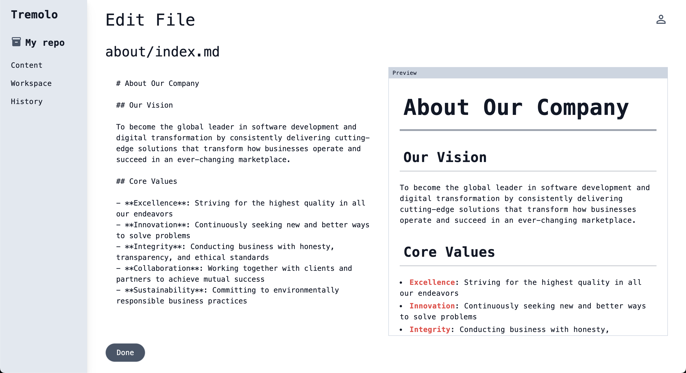

## Table of Contents

- [Overview](#overview)
- [Tech Stack](#tech-stack)
- [Development Setup](#development-setup)
- [Build and Start](#build-and-start)
- [Development Mode](#development-mode)
- [Access Information](#access-information)
- [Login Information](#login-information)

## Overview

This project is aimed at learning Laravel.  
It is designed as a web service where users can easily build a website with Markdown and the concept of Git is introduced for managing Markdown.



## Tech Stack

- Language: PHP
- Framework: Laravel
- JS Framework: Alpine.js
- CSS Framework: Tailwind CSS

## Development Setup

### Create `.env` file

```sh
cp .env.example .env
```

## Build and Start

### Build

```sh
docker compose build
```

### Start

```sh
docker compose up -d
```

### Execute Migration

```sh
docker exec -it tremolo-app php artisan migrate
```

### Register Sample Data

```sh
docker exec -it tremolo-app php artisan db:seed
```

### Stop

```sh
docker compose down
```

## Development Mode

```sh
docker exec -it tremolo-app npm run dev
```

## Access Information

In the local environment, you can access it at http://tremolo.localhost.

## Login Information

The following sample users are provided for testing. Sample users will be created when executing `docker exec -it tremolo-app php artisan db:seed`.

| Email Address | Password |
| ---- | ---- |
| bob@example.com | uHrdx55u |
| john@example.com | uHrdx55u |
